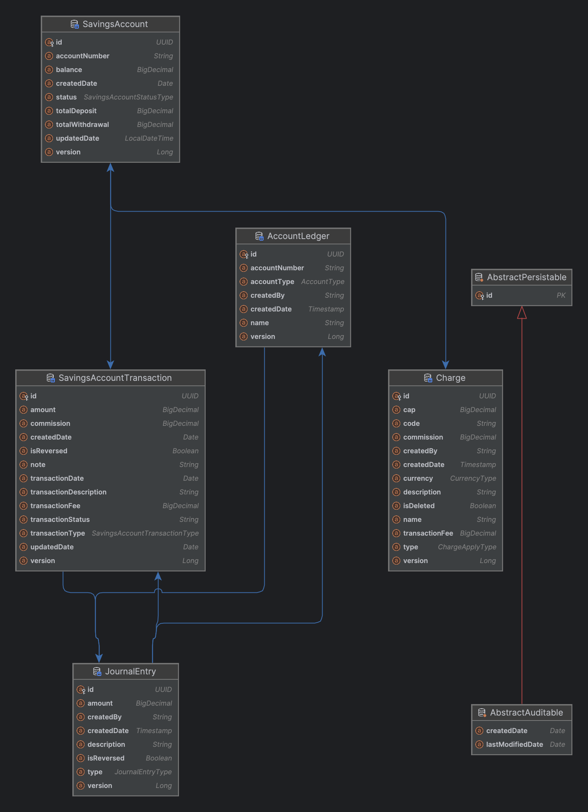

# Getting Started

### Reference Documentation

Postman [Published Postman Documentation](https://documenter.getpostman.com/view/9582699/2sAXjQ3Aum)

For further reference, please consider the following sections:

* [Official Gradle documentation](https://docs.gradle.org)
* [Spring Boot Gradle Plugin Reference Guide](https://docs.spring.io/spring-boot/3.3.3/gradle-plugin)
* [Create an OCI image](https://docs.spring.io/spring-boot/3.3.3/gradle-plugin/packaging-oci-image.html)
* [Spring Boot Actuator](https://docs.spring.io/spring-boot/docs/3.3.3/reference/htmlsingle/index.html#actuator)
* [Spring Batch](https://docs.spring.io/spring-boot/docs/3.3.3/reference/htmlsingle/index.html#howto.batch)
* [Spring Cache Abstraction](https://docs.spring.io/spring-boot/docs/3.3.3/reference/htmlsingle/index.html#io.caching)
* [Spring Configuration Processor](https://docs.spring.io/spring-boot/docs/3.3.3/reference/htmlsingle/index.html#appendix.configuration-metadata.annotation-processor)
* [Spring Data JDBC](https://docs.spring.io/spring-boot/docs/3.3.3/reference/htmlsingle/index.html#data.sql.jdbc)
* [Rest Repositories](https://docs.spring.io/spring-boot/docs/3.3.3/reference/htmlsingle/index.html#howto.data-access.exposing-spring-data-repositories-as-rest)
* [Spring Boot DevTools](https://docs.spring.io/spring-boot/docs/3.3.3/reference/htmlsingle/index.html#using.devtools)
* [Flyway Migration](https://docs.spring.io/spring-boot/docs/3.3.3/reference/htmlsingle/index.html#howto.data-initialization.migration-tool.flyway)
* [JDBC API](https://docs.spring.io/spring-boot/docs/3.3.3/reference/htmlsingle/index.html#data.sql)
* [Jersey](https://docs.spring.io/spring-boot/docs/3.3.3/reference/htmlsingle/index.html#web.servlet.jersey)
* [Java Mail Sender](https://docs.spring.io/spring-boot/docs/3.3.3/reference/htmlsingle/index.html#io.email)
* [Quartz Scheduler](https://docs.spring.io/spring-boot/docs/3.3.3/reference/htmlsingle/index.html#io.quartz)
* [Spring REST Docs](https://docs.spring.io/spring-restdocs/docs/current/reference/htmlsingle/)
* [Spring Shell](https://spring.io/projects/spring-shell)
* [Validation](https://docs.spring.io/spring-boot/docs/3.3.3/reference/htmlsingle/index.html#io.validation)
* [Spring Web](https://docs.spring.io/spring-boot/docs/3.3.3/reference/htmlsingle/index.html#web)
* [Spring Web Services](https://docs.spring.io/spring-boot/docs/3.3.3/reference/htmlsingle/index.html#io.webservices)
* [Spring Reactive Web](https://docs.spring.io/spring-boot/docs/3.3.3/reference/htmlsingle/index.html#web.reactive)


### Entity Relationship Diagram




### Running the application
* Clone the repository
* Create a database in PostgreSQL
* Update the application.properties file with the database credentials
* Run the application with the following command: ./gradlew bootRun or with intellij
* Use Postman to test the endpoints
* The application runs on port 8081

```shell
Build the project:  
```shell
./gradlew build
```
Run the application:  
```shell
./gradlew bootRun
```

### Technologies Used
* Intellij IDEA
* Java
* Spring Boot
* Spring Batch
* Spring Data JPA
* Gradle

### Getting Started

#### Prerequisites
* Java 11 or higher
* Gradle
* PostgreSQL

### Assumptions
* Transactions are large in volume and need to be processed in batches.
* The transactions are stored in a database and need to be read from the database.
* Transaction summary  needs to be sent to the user via email.


#### Improvements
* Send Transaction Summary to the user via email.
* Error Handling: Enhance error handling mechanisms to provide more detailed and user-friendly error messages.
* Security: Implement authentication and authorization to secure the endpoints.
* Scalability: Optimize the batch processing to handle larger volumes of transactions efficiently.
* Testing: Increase test coverage, especially for edge cases and integration tests.
* Documentation: Improve API documentation using tools like Swagger.


### Simulate concurrent transfer
* You could run the test.transfer.go file to simulate concurrent transfer of funds between accounts.
* The test.transfer.go file is located in the root folder.